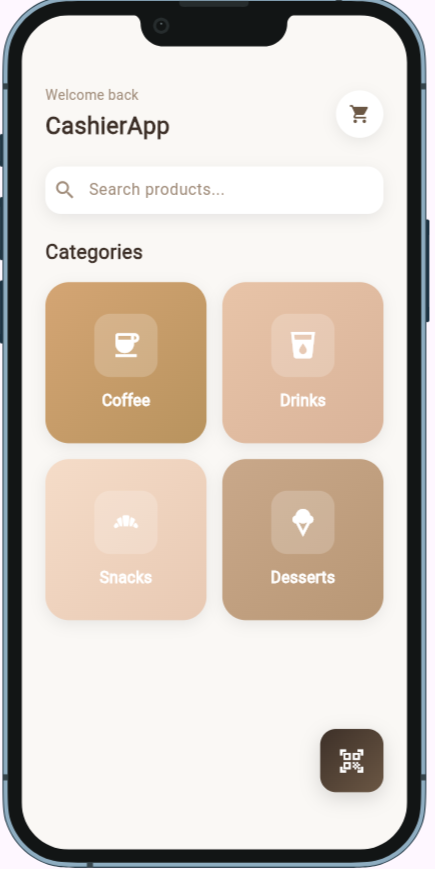
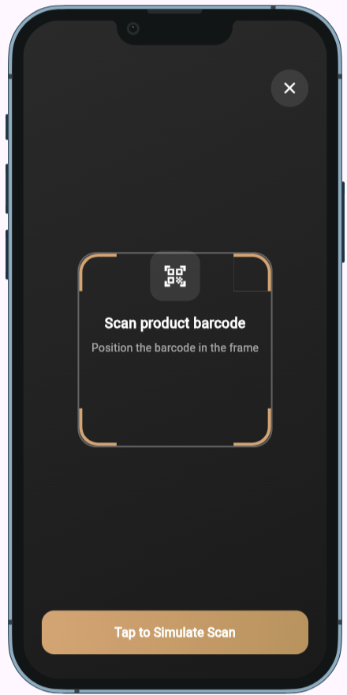
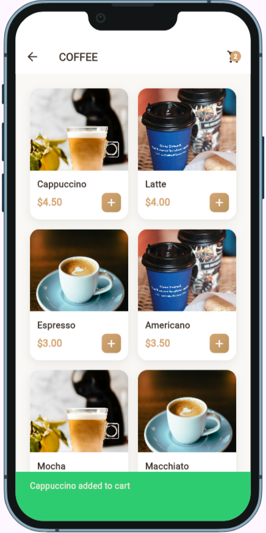
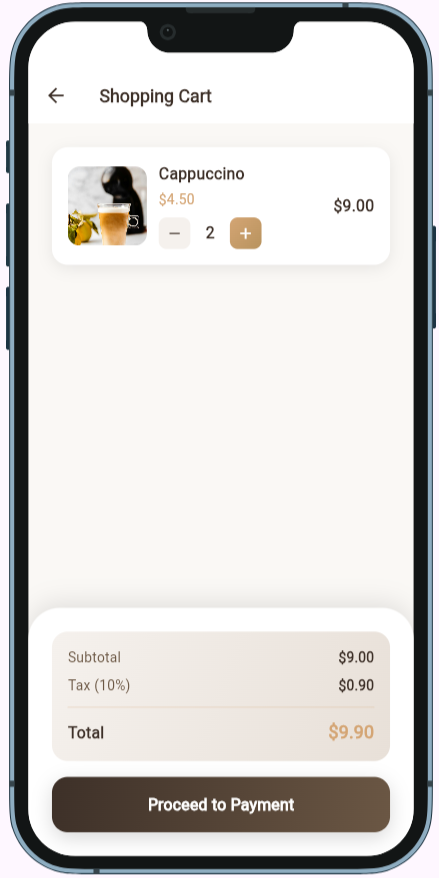
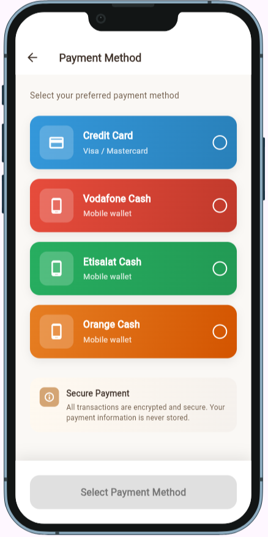
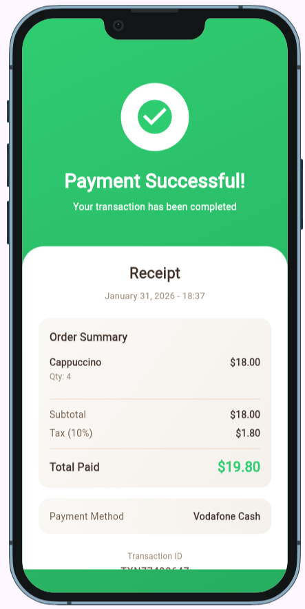

- 🔭 I’m currently working on [Building mobile apps with Flutter](https://github.com/ahmedhamada202113227-maker/football_app)

- 🌱 I’m currently learning **Advanced Flutter • Clean Architecture • State Management**

- 👯 I’m looking to collaborate on **Flutter & Mobile App Projects**

- 👨‍💻 All of my projects are available at [https://github.com/ahmedhamada202113227-maker](https://github.com/ahmedhamada202113227-maker)

- 💬 Ask me about **Flutter, Android, Mobile App Development**

- 📫 How to reach me **ahmedhamada202113227@gmail.com**

- 📄 Know about my experiences [## 💻 Technical Experience - **Flutter & Android Development** Built multiple cross-platform mobile apps with Flutter, focusing on clean architecture and scalable code. - **Git & GitHub** Experienced in version control, branching strategies, pull requests, and collaborative workflows. - **Firebase & Backend Integration** Integrated apps with Firebase Auth, Firestore, and Cloud Functions. - **UI/UX Implementation** Designed intuitive and responsive user interfaces, following best practices for user experience. ## 🧠 Soft Skills - Problem Solving & Logical Thinking - Team Collaboration & Communication - Time Management & Productivity](## 💻 Technical Experience - **Flutter & Android Development** Built multiple cross-platform mobile apps with Flutter, focusing on clean architecture and scalable code. - **Git & GitHub** Experienced in version control, branching strategies, pull requests, and collaborative workflows. - **Firebase & Backend Integration** Integrated apps with Firebase Auth, Firestore, and Cloud Functions. - **UI/UX Implementation** Designed intuitive and responsive user interfaces, following best practices for user experience. ## 🧠 Soft Skills - Problem Solving & Logical Thinking - Team Collaboration & Communication - Time Management & Productivity)


- #  Cashier Coffiee - Flutter App

## 📱 نظرة عامة

☕ Cashier Coffee App

Cashier Coffee App is a point-of-sale (POS) application designed specifically for coffee shops and small cafés.
The app helps cashiers manage orders quickly and accurately, providing a smooth checkout experience while keeping the interface simple and efficient.

Built with a clean architecture and a modern UI, the app focuses on speed, usability, and reliability in fast-paced café environments.


🚀 Features

- 🧾 Create and manage customer orders
- ☕ Coffee & drinks menu management
- ➕ Add, update, and remove items from orders
- 💵 Real-time order total calculation
- 🖨️ Ready for receipt printing integration
- 📱 Responsive layout for tablets and mobile devices


🔮 Future Improvements

- Inventory & stock management
- Sales reports & analytics
- Multiple payment methods
- User roles (cashier / admin)
- Dark mode support


## 🏗️ البنية المعمارية
التطبيق مبني على نمط **MVVM** (Model-View-ViewModel):

```
lib/
├── models/           # Data structures
├── viewmodels/       # Business logic + State management
├── views/            # UI screens
├── services/         # Storage and utilities
└── utils/            # Constants and themes
```

## 📋 المتطلبات
- Flutter SDK 3.0.0 أو أحدث
- Dart 3.0.0 أو أحدث
- Android Studio / VS Code
- Android SDK (للأندرويد)
- Xcode (للآيفون - macOS فقط)

### 5. تشغيل التطبيق
```bash
# لتشغيل على المحاكي أو الجهاز المتصل
flutter run

# لتشغيل على جهاز معين
flutter run -d <device-id>

# لعرض الأجهزة المتاحة
flutter devices
```

## 📦 الحزم المستخدمة

| الحزمة |
|--------|
| cached_network_image |
| intl |
| google_fonts |
| provider |
| font_awesome_flutter |
| google_fonts |
| flutter_svg |

## 📱 الشاشات

### 1. Home Screen
شاشة البداية مع شعار التطبيق

### 2. Cart Screen 
<!-- - شاشة ترحيب
- شرح الميزات
- اختيار المدينة -->

### 4. Payment Screen
<!-- - 8 رسائل تحفيزية يومية
- نظام القراءة والتتبع
- قفل تلقائي حسب الوقت -->

### 5. Paymet Methods Screen
<!-- - تقويم شهري
- تحديد الأيام الناجحة/الفاشلة
- قفل الأيام المستقبلية -->

### 6. Product List Screen
<!-- - 5 صلوات يومية
- فتح تلقائي حسب الوقت
- مؤثرات احتفالية عند الإنجاز -->

### 7. BarCode Screen
<!-- - 5 صلوات يومية
- فتح تلقائي حسب الوقت
- مؤثرات احتفالية عند الإنجاز -->


## 🎨 التصميم

### الألوان الأساسية
```dart
Color1: #34D399
Color2: #FFFFFF
Color3: #09090B
Color4: #EF4444
Color5: #47464F
```

<!-- ## 💾 التخزين المحلي

يستخدم التطبيق **SharedPreferences** لحفظ:
- حالة Onboarding
- سلسلة النجاح (Streak Days)
- الرسائل المقروءة
- بيانات التقويم
- الصلوات المنجزة
- المذكرات
- المكافآت
- الإعدادات (المدينة، Dark Mode، إلخ) -->

## 📱 البناء للإنتاج

### Android
```bash
# بناء APK
flutter build apk --release

# بناء App Bundle (للنشر على Google Play)
flutter build appbundle --release
```

### iOS
```bash
# بناء IPA
flutter build ios --release
```

## 🔐 الأمان والخصوصية
- **جميع البيانات محلية:** لا يتم إرسال أي بيانات لخوادم خارجية
- **عدم جمع بيانات شخصية:** التطبيق لا يجمع معلومات المستخدم
- **الخصوصية التامة:** المذكرات والبيانات محفوظة على الجهاز فقط

## 📊 الميزات المستقبلية (اختياري)
- [ ] دعم النسخ الاحتياطي على السحابة
- [ ] تكامل مع API لأوقات الصلاة الحقيقية
- [ ] إشعارات محلية للتذكير
- [ ] رسوم بيانية للتقدم
- [ ] مشاركة الإنجازات
- [ ] دعم لغات إضافية

## 🤝 المساهمة
هذا المشروع جاهز للاستخدام والتطوير. يمكنك:
- إضافة ميزات جديدة
- تحسين التصميم
- إصلاح الأخطاء
- ترجمة التطبيق

## 📄 الترخيص
هذا المشروع مفتوح المصدر ومتاح للاستخدام الشخصي والتجاري.

## 📞 الدعم
للأسئلة أو المشاكل:
1. راجع هذا الدليل
2. راجع ملف `IMPLEMENTATION_GUIDE.md`
3. تحقق من التعليقات في الكود

## 🎉 مبروك!
التطبيق جاهز للاستخدام. رحلة موفقة! 💪

---

**تم التطوير بـ ❤️ لمساعدة الأشخاص في تنظيم اليوم**

<!-- **لا تنسَ:** "النجاح ليس عدم الوقوع، بل القيام بعد كل مرة تقع فيها" -->


# Cashier Coffiee - App 

Here are some screenshots of my app:







